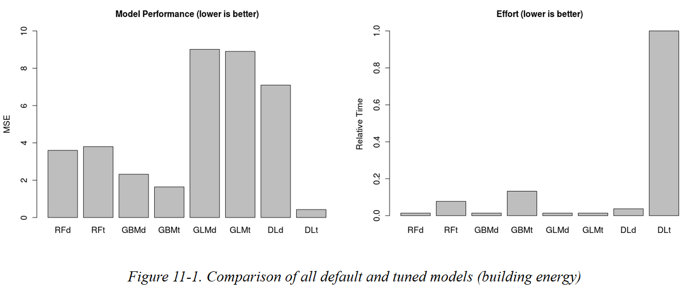

```{r setup, include=FALSE, tidy=TRUE}
knitr::opts_chunk$set(cache = TRUE, tidy = TRUE)
# Set seed (for reproducibility)
set.seed(12345)
```

## Boosting {.tabset}
This is an **opinionated** demo of boosting with an application to predicting
loan default. The caveat is
I won't tell you a whole lot about what boosting is in this session. 
I'll defer to the next session for that. 
Because the goal in this session is to present something readily 
applicable, I'll focus on a case study.
First you see boosting at work.
And it works stupendously well: [`xgboost`](https://github.com/dmlc/xgboost), 
an implementation of boosting optimized for speed and predictive performance, 
is a perennial favourite in [Kaggle](https://www.kaggle.com/) competitions.
Then you wonder why it works. And so you go back to dig up answers.
The presentation is, by design, front-loaded: heavy on code, light on theory.
It emulates end-to-end -- to use the term generously -- model development.

To the ~~Batmobile~~ case study!

## Setup {.tabset}
I am using `R`. I love `Python`. I like `Julia`. And `Clojure`. And `F#` too.
But for this demo, it's `R`. Enough said.

I could use a full-featured framework for this. To name a few,
[`caret`](http://topepo.github.io/caret/index.html) (`R`), 
[`mlr`](https://mlr-org.github.io/mlr/index.html) (`R`) or 
[`scikit-learn`](http://scikit-learn.org/stable/) (`Python`)
would do the job. I won't be doing that.
For exposition, I use more low-level and modular 
libraries/packages to peek under the hood. 

I find that implementing stuff from scratch -- for some notion of *scratch* -- 
is a great way to make sure I understand. Or at least, that I am not fooling myself.
Remember Feynman's first principle?

> The first principle is that you must not fool yourself
> and you are the easiest person to fool. 

Here is the stuff you need to get going in `R`.

```{r setupPackages, message=FALSE}
# Load packages
suppressPackageStartupMessages({
  packages <- c("ggplot2", "DataExplorer", "pROC", "xgboost", "data.table", "broom", "recipes", "rsample", "rBayesianOptimization", "WVPlots")
  isLoaded <- sapply(packages, library, character.only = T, logical.return = T, quietly = T )
  toInstall <- packages[!isLoaded]
  if (length(toInstall) > 0L) {
    install.packages(toInstall)
    sapply(toInstall, library, character.only = T, logical.return = T, quietly = T)
  }
  rm(packages, isLoaded, toInstall)
})
```

## Data {.tabset}
The case study is to predict loan defaults from some variables.
It is a classification problem.
The data comes from 
[here](https://www.datacamp.com/courses/introduction-to-credit-risk-modeling-in-r).
Let's download the data and mess about.

```{r downloadData}
# Load (download) dataset
urlToData <- "https://assets.datacamp.com/production/course_1025/datasets/loan_data_ch1.rds"
savePath <- tempfile(fileext = ".rds")
download.file(urlToData, destfile = savePath, mode = "wb")
loanData <- readRDS(savePath)
# Clean up
rm(urlToData, savePath)
# Convert default status to factor
setDT(loanData)
loanData[, loan_status := factor(loan_status)]
```

### Salient features {.tabset}
So what have we learned from this exploratory exercise?
I'm calling these *salient features*. Economists prefer *stylized facts*.

In increasing order of importance, we see that

1. annual income (`annual_inc`) is highly skewed.
2. employment length (`emp_length`) and interest rate (`int_rat`) have missing values.
3. class imbalance in default status (`loan_status`) is quite severe.

For (1), we need to transform/normalize the variable. The log transform
is typical for income. 

For (2), we need to impute the missing values. This can be tricky.
See @rubin1996multiple for an overview. A recurring theme in 
this literature is that using the mean is almost always the wrong procedure.
This is in line with the theorem,

> It is easy to do the wrong thing.

(no such theorem exists AFAIK). 

Imputation via bagged (bootstrap aggregated) trees is an effective,
albeit computationally intensive, method to impute missing values.
See @saar2007handling for a reference. That is the method I use.

For (3), we need to address class imbalance. The majority class (*no default*)
dominates the sample to the tune of 9 to 1. 
This means that in our case study, a naive
classifier can easily achieve an accuracy of 90% by predicting *no default* on
all instances. And it does so by ignoring *default* altogether.
And yet predicting *default* is the goal.
Presumably *default* is very costly, perhaps 
orders of magnitude more so than *no default*.
So we want to nudge the classifier to give *default* the
appropriate weight. The data alone tilts -- some might say, biases -- the 
balance in favour of the majority, at the expense of the minority.
How do we redress this balance? 

One way to do this is to give weights to observations. The idea is 
startlingly simple to implement, intuitive and effective (the elusive trifecta?).
Weigh each observation with the inverse probability of its
class. Thus, the majority and minority class are assigned
scaling factors of `r round( 1/0.9, 2)` and `r round( 1/0.1, 2)` respectively to
counter the effect of class imbalance.
I implictly assume equal importance for both classes.
This 50/50 weighting scheme stops the model from overfitting to the
majority class.
In essence, the method penalizes errors based on the class. Errors on the
minority are amplified; those on the majority are (comparatively) downweighted.
This is a sneaky variant of regularization. Whereas regularization
often targets the model (hyper-)parameters, here regularization
applies at the observation-level.

#### Additional resources
In some applications, class imbalance is even more severe.
Fraud detection is a prime example.
The needle-in-a-haystack analogy is an apt description of the problem.
See @barandela2003strategies for a good (academic) reference on the topic. In line
with the stated goal of the presentation to be code-centric, 
see @lemaitre2017imbalanced
for a `Python` package that does a lot of the plumbing for you. Also, see
this [`PyData`](https://youtu.be/-Z1PaqYKC1w) talk for a comparison of the
remedial methods.

#### Strategies for class imbalance
You can safely skip this section if you do not want to ponder class imbalance any further.
Supposedly the focus of the case study is to show the effectiveness of *boosting*.
This is a detour, an important one, mind you but still a detour. 
So I freely grant you license to skip.

Take a deep breath -- it is a long list. 
Here are some mitigating strategies for confronting class imbalance:

  1. using cost-sensitive loss function/matrix (a variant of regularization),
  2. weighting observations by inverse frequency of class (yet another variant of regularization), 
  3. undersampling the majority class, 
  4. oversampling the minority class,
  5. selecting appropriate performance metrics: accuracy can be your enemy (see Cohen's Kappa and ROC curves),
  6. changing the fitting algorithms (e.g zero-inflated and hurdle models),
  7. incorporating more information from the business application/domain,
  8. generating synthetic samples (e.g SMOTE aka Synthetic Minority Over-sampling Technique).

In short, they lied: deep learning alone won't solve all our problems.
The joke, of course, is that I am only half joking. 
I have ordered the list of mitigating strategies to reflect **my own** preferences.
Your mileage may vary. Notice that I use (2) for this case study.

#### Remarks
Again, you can safely skip this section.

First, these methods for handling class imbalance are not mutually exclusive; 
you can combine them as you see fit.
If you combine them however, moderation is key.
The risk of abusing these methods, and in so doing mangling/distorting the
initial problem beyond recognition is not trivial.

Second, many of these methods, but in particular
(1) and (7), entail bringing more information to bear on the problem.
This information ideally comes from domain experts.
You **should not** shun this avenue. A dogmatic and sometimes
dangerous position from analysts is to assume no prior knowledge required. 
Many non-parametric methods appeal because they promise to
extract actionable insights from data without looping in experts.
Cases in point, decision trees and neural networks.
The kicker is, sometimes they do exactly that: they beat the *experts* at 
their own games. But this is not universally true. Sometimes, they do not. 
And you have to recognize the difference. In such situations, ignoring
domain knowledge is throwing away potentially valuable insights. If you
can incorporate or embed this *prior* (and I am intentionally using
this term with all its Bayesian connotations) into the model,
it can dramatically improve your predictive model.

Third, you may notice that simply correcting for class imbalance could make
simple models competitive with more complex models. That is, your
humble logistic regression can rival random forests, once you account for
class imbalance. And so the focus on the method itself, logistic regression
versus ensemble of decision trees, can be misleading. 
Pay attention to what matters most.
It may turn out that you get the most bang for your buck with a simple hack.

### Exploratory analysis {.tabset}
This exploratory step of looking at the data is vital.
Never skip it before modeling.
It isn't the glorious part of the job but it paves the way.
No shortcut: get to know your data inside out.
This is how you generate plausible hypotheses.
Let's peek at the data so far.

```{r peekData}
head(loanData)
```
The column names are fairly self-explanatory. They are what you *think* they are.
`loan_status`, for example, indicates whether the loan is in default.
And so, I won't belabor the point. 

```{r summarizeData}
summary(loanData)
```

#### Missing values 
Let's look at missing data.
```{r missingData}
theme_set(theme_bw())
plot_missing(loanData)
```

#### Conditional distributions
Let's look at categorical/discrete variables.
```{r categoricalVariables}
plot_bar(loanData)
```

And lastly, some boxplots for the continuous variables
```{r continuosVariables}
plot_boxplot(loanData, "loan_status")
```


## Preprocessing {.tabset}
Let's do some of the janitorial work necessary before training the boosting model.

### Training/Test split
I split the dataset into 67% training and 33% test set. 

I ensure that this split reflects and maintains class imbalance 
with stratified sampling.

```{r splitTrainTestData}
splitData <- initial_split(loanData, prop = 2/3, strata = "loan_status")
trainData <- training(splitData)
# Clean up
rm(loanData)
```

### Design Matrix
From exploratory analysis, we know we need to transform some variables.
Some call this step *preprocessing*; others still, *feature engineering* (popular
in machine learning and data mining communities).
Statisticians prefer the term *design matrix* to refer to the transformed/final
dataset ready for modeling.
I create a recipe to replicate the necessary transformations.

```{r designMatrix}
# Add steps to create design matrix
xgbRecipe <- recipe(loan_status ~ ., data = trainData) %>%
  step_bagimpute(emp_length, int_rate) %>%
  step_log(annual_inc) %>%
  step_dummy(all_nominal())
xgbRecipe
```

### Cross-validation
For boosting, we need to tune (hyper-)parameters.
I use 10-fold cross-validation repeated 10 times for this purpose.
This means that we end up with a total of 100 train-validate pairs,
where training is 90% of the original training dataset and the
validation is the remaining 10%. Let's peek at the first 6
of these pairs.

```{r crossValidation}
trainingFolds <- vfold_cv(
  trainData,
  v = 10,
  repeats = 10,
  strata = "loan_status")
setDT(trainingFolds)
# Quick peek
head(trainingFolds)
```

### Learning curves
A mistake I sometimes see is the urge to use most of the data right away.
It is the lure of *Big Data* and it is a trap.
And I say this as a [Spark](https://spark.apache.org/) 
user and enthusiast.
Some models may require Terabytes or,
heaven helps you, Petabytes of training examples.
That is Google scale. Most problems, I venture, are not Google scale.
Most problems fit in 
[RAM](https://news.ycombinator.com/item?id=9581862) - yes,
that means even yours.
Start small instead and gradually increase your training set if and only if
the predictive performance of your algorithm improves markedly in doing so.

[Learning curves](http://scikit-learn.org/stable/auto_examples/model_selection/plot_learning_curve.html) 
can inform the decision of how much data to use for training the
model before the predictive performance plateaus.
More data beyond that point is wasted CPU/GPU cycles, cluster headaches and network latency. 
Learning curves also highlights the limit of your chosen model architecture.
If more data does not boost performance to the desired levels,
it is time to consider changing the model and/or harvest more/better features
from the data.

Statisticians are formally trained to appreciate the value of samples. 
You can do wondrous things with samples, they teach.
You do not need the whole population, they say. So, sample. And sample aggressively.
This is all very *stats 101* and yet, worth stating again if it is all fuzzy now.

### Helper functions
This is a helper function to assign frequency/event probability to defaults.

```{r assignFrequency}
assignFrequency <- function(defaults) {
  # Get frequency table
  freqTable <- as.data.frame(prop.table(table(defaults)))
  mapClassToFreq <- freqTable[['Freq']]
  names(mapClassToFreq) <- freqTable[[1]] # Original levels
  return(unname(mapClassToFreq[defaults]))
}
```

## `xgboost` Format 
`xgboost` is optimized to work with its own data format. 
`xgboost` takes `dgCMatrix` objects.
I create here a function, `extractDMatrix`, to convert the train-validate pair
into the corresponding `dgCMatrix` objects. 

```{r extractDMatrix}
extractDMatrix <- function( splitObj, recObj = xgbRecipe, colPredict = "loan_status") {
    # Use 90% for training the model
    fitData <- analysis(splitObj)
    prepObj <- prep(recObj, training = fitData, retain = TRUE, verbose = FALSE)
    # Create inverse frequency weights to correct imbalances
    frequencies <- assignFrequency(fitData[[colPredict]])
    weights <- 1 / frequencies
    # Create xgboost DMatrix for training model
    xgbTrainData <- xgb.DMatrix(
      data = juice(prepObj, -contains(colPredict), composition = "dgCMatrix"),
      label = juice(prepObj, contains(colPredict), composition = "dgCMatrix")
    )
    # Use the remaining 10% for validation
    holdoutData <- assessment(splitObj)
    # Create xgboost DMatrix for validating model
    xgbValidateData <- xgb.DMatrix(
      data = bake( prepObj, newdata = holdoutData, -contains(colPredict), composition = "dgCMatrix" ),
      label = bake( prepObj, newdata = holdoutData, contains(colPredict), composition = "dgCMatrix" )
    )
    return( list( train = xgbTrainData, validate = xgbValidateData, weight = weights ) )
  }
```

This wrapper function, `extractDMatrix`, also returns the weights from 
the inverse probability transformation to correct for class imbalance.

```{r convertToDMatrix}
system.time({
  listDMatrix <-
    lapply(trainingFolds[['splits']], function(x)
      extractDMatrix(x))
})
```

I end up with a list of these `dgCMatrix` pairs, ready for model fitting.
As a side note, creating these paired design matrices -- all 100 of them -- is a 
computational bottleneck. It takes, a little under 4 minutes on my machine. 
It is worth caching the results. This concludes the data preparation steps.

## Hyper-parameters {.tabset}
And now we get to the heart of `xgboost`. Boosting has hyper-parameters, lots of 'em. 
Take this reductionist definition: boosting **is** tuning the hyper-parameters. 
This is how you wring out every drop of predictive perfomance,
its value proposition, out of boosting. 
Some hyper-parameters, however, are specific to the implementation.
Not all boosting software offers the same options.
See [here](http://xgboost.readthedocs.io/en/latest/parameter.html)
for a comprehensive list of `xgboost` parameters.
Besides `xgboost`, other implementations of boosting include:

* [`H20`](http://docs.h2o.ai/h2o/latest-stable/h2o-docs/data-science/gbm.html)
* [`scikit-learn`](http://scikit-learn.org/stable/modules/generated/sklearn.ensemble.GradientBoostingClassifier.html)
* [`gbm`](https://cran.r-project.org/web/packages/gbm/index.html)

How do we tune these hyper-parameters? We anticipated this point.
I'll use cross-validation.

### Additional resources
Understanding the boosting hyper-parameters is
the difference between driving stick and being on autopilot.
The next session tackles these hyper-parameters in depth. 
For an introduction, see Chapter 8 (`Tree-Based Methods`) of @james2013introduction.
For more academic references, 
see @buhlmann2007boosting,
@friedman2002stochastic,
and @friedman2001greedy.
Prefer videos? See
this [`talk`](https://youtu.be/wPqtzj5VZus) from the inimitable Trevor Hastie 
and this [`talk`](https://youtu.be/UHBmv7qCey4).
A pet peeve of mine is that boosting, more than likely for historical reasons (see `AdaBoost`), 
is usually introduced jointly with (ensemble of) decision trees. But it need not be. 
It conflates two very different although complimentary ideas.
Boosting is a general idea and it can be applied to a whole sleuth of other algorithms.
I won't say much more than that for now.

### Fixed
Let's fix some hyper-parameters of interest.
```{r fixedParams}
# Fixed parameters
fixedParams <- list(
  booster = "gbtree",
  objective = "binary:logistic",
  nthread = parallel::detectCores() - 1L,
  eval_metric = "auc"
)
```

### Tune
Let's set the hyper-parameters to tune and give them some default values.

```{r tuneParams }
# Tuning parameters (set at their default)
# lambda, L2 regularization term on weights
# alpha, L1 regularization term on weights
tuneDefaultParams <- list(
  eta = 0.3,
  max_depth = 6L,
  subsample = 1,
  lambda = 1.0,
  alpha = 0.0
)
```

### Bounds
Let's determine the bounds to use for the hyper-parameter search.

```{r boundParams}
# Set initial parameters
initParams <- c(fixedParams, tuneDefaultParams)
# Define the bounds of the search for Bayesian optimization
boundsParams <- list(
  eta = c(0.1, 0.8),
  max_depth = c(3L, 6L),
  subsample = c(0.5, 1),
  lambda = c(1.0, 5.0),
  alpha = c(0.0, 5.0)
)
```

### Defaults
If it is any consolation, `xgboost` comes with good default hyper-parameters
for the vast majority of problems. That is not to say, use the default hyper-parameters
as is. On the contrary, ideally tune to your specific problem. 
The defaults often are, however, a good starting point.

## Performance metric {.tabset}
What performance metric do I use for cross-validation? The easy answer is,
I use the area under the curve (AUC) of the 
receiver operating characteristic (ROC) curve. 
If you need a refresher, here is a quick primer on 
[AUC](https://developers.google.com/machine-learning/crash-course/classification/roc-and-auc).
But by now, you are inoculated against **easy** answers, aren't you?

Let's channel Douglas Crockford (see `Javascript`). 
First stop is, *AUC: The Good Parts*.
AUC is both scale invariant and classification-threshold invariant.
As opposed to accuracy, AUC can do fairly well for problems with severe class imbalance.
Next stop is, *AUC: The Bad Parts*.
Scale and threshold invariance are not always desirable
(you saw that coming, right?).
And in fact, we can argue that because of the alleged disparities in
the cost of `default` versus `no default`, we should ditch
threshold invariance. See @lobo2008auc for a sobering account of how even 
the mighty AUC can let you down in some circumstances.

If `default` is what we care about the most, this suggests
using the true positive rate detection rate as perhaps the most natural
perfomance metric.

But for now I assert, and the benchmark model will corroborate, 
that AUC is an adequate perfomance metric for our
case study.

### Helper functions
I create some helper functions to help us compute and maximize AUC
scores during cross-validation.

```{r aucFunctions}
# Calculate AUC for a single train-validate pair using CV
getAUCFromCV <- function(listData,
                         useInverseFrequencyWeight = TRUE,
                         params = initParams,
                         verbose = 0) {
  # Train model
  watchlist <-
    list(train = listData$train, test = listData$validate)
  weight <- if (useInverseFrequencyWeight)
    listData$weight
  else
    NULL
  xbgModel <- xgb.train(
    params = params,
    data = listData$train,
    watchlist = watchlist,
    verbose = verbose,
    callbacks = list(xgboost::cb.evaluation.log()),
    nrounds = 50,
    early_stopping_rounds = 5,
    weight = weight
  )
  # Extract AUC
  testAUC <- tail(xbgModel$evaluation_log[["test_auc"]], 1)
  return(testAUC)
}
# Calculate mean AUC for all train-validate pairs
getMeanAUC <- function(listDMatrix,
                       useInverseFrequencyWeight = TRUE,
                       params = initParams) {
  scores <- sapply(
    listDMatrix,
    getAUCFromCV,
    useInverseFrequencyWeight = useInverseFrequencyWeight,
    verbose = 0,
    params = params
  )
  meanAUC <- mean(scores)
  return(meanAUC)
}
```

### NFL Theorem
One lesson here is to consider the trade-offs.
Remember the 
[No free lunch (NFL) theorems](https://en.wikipedia.org/wiki/No_free_lunch_theorem#Original_NFL_theorems)? 
There is no such thing as a panacea -- 
not quite (not even close) what it says, but good enough for government work. 
Repeat it a 100x, 1e6x and internalize the message.
Any time someone (on the internet or elsewhere) tries to sell you the meta-algorithm, 
the one ring to rule 'em all, be skeptical. 

Jokes aside, the NFL theorem originally stated,

> if an algorithm performs well on a certain class of problems then it necessarily pays for 
> that with degraded performance on the set of all remaining problems

## Bayesian optimization {.tabset}
Grid and random search are often the methods used to select
the pool of hyper-parameter candidates. The selected candidates 
are then evaluated with cross-validation. You pluck the best one
out of this fixed set.

Exhaustive grid search is computationally expensive -- prohibitively
so. Random search is well, *random*. It explores the hyper-parameter space
wastefully. You can repeatedly sample bad hyper-parameters. And it does not
inform your search strategy to pick better candidates. 
Can we do better? Is there a principled
and systematic way to balance hyper-parameter optimization 
-- *exploitation* is the term that the literature uses for this,
perhaps due to its connection to the multi-armed bandit problem --  
and exploration? Bayesian optimization, to the rescue.

I randomly choose 10 initial starting points from the hyper-parameter space.
I then run bayesian optimization for 30 iterations to find the best
hyper-parameters. I print the partial history of this
sequential search for the last 6 iterations.

```{r bayesOptim}
# Create wrapper function for Bayesian Optimization
maximizeAUC <- function( eta, max_depth, subsample, lambda, alpha ) {
    # Create list of updated parameters
    replaceParams <- list( eta = eta, max_depth = max_depth, subsample = subsample, lambda = lambda, alpha = alpha )
    updatedParams <- modifyList(initParams, replaceParams)
    # Calculate AUC with updated parameters
    scoreAUC <- getMeanAUC( listDMatrix, params = updatedParams, useInverseFrequencyWeight = TRUE )
    resultList <- list(Score = scoreAUC, Pred = 0)
    return(resultList)
}
# Run bayesian optimization
bayesSearch <- BayesianOptimization(
  maximizeAUC,
  bounds = boundsParams,
  init_grid_dt = as.data.table(boundsParams),
  init_points = 10,
  n_iter = 30,
  acq = "ucb",
  kappa = 2.576,
  eps = 0.0,
  verbose = FALSE
)
# Get optimized parameters
tunedBayesianParams <- modifyList(fixedParams, as.list(bayesSearch$Best_Par))
# Peek at history of bayesian search
tail(bayesSearch$History)
```

If you looked at the code, I am sure the irony did not escape you.
Bayesian optimization, a method for hyper-parameter tuning, has itself a 
few hyper-parameters of its own. What can I say? **No free lunch**.

### Additional resource
For a good overview of Bayesian optimization, see
@shahriari2016taking and @snoek2012practical.
By the way, I love the title **Taking the human out of the loop**.
For software (`Python`), in line with the theme of 
the presentation, see @martinez2014bayesopt.

Once you delve into Bayesian optimization, you encounter
Gaussian processes. At that juncture, non-parametric Bayesian
models are right around the corner. The Dirichlet process is
typically the gateway drug into that world. 

### Big ideas
If you're keeping score, Bayesian optimization is the third big idea
encountered so far (boosting and class imbalance, being the other two). 

Bayesian optimization is an invaluable tool to have in your arsenal. 
And this is going
to be more and more the case because of the explosion of non-parametric
models that require and are highly sensitive to hyper-parameter tuning. 
*Deep learning*, I'm looking at you.
Having said tongue-in-cheek that boosting **is** hyper-parameter tuning, the
importance of a smart strategy to tune hyper-parameters should be
obvious.

Bayesian optimization does to hyper-parameter tuning what
cloud computing does to [*sysadmin*](https://en.wikipedia.org/wiki/System_administrator).
It levels the playing field and democratizes machine learning.
You need not be Geoffrey Hinton to tune hyper-parameters
well. You can focus on something else.

Ask me what I am excited and learning about in my free time.
Spoiler alert, it is not *cryptocurrency*. 
My focus is on *Bayesian methods* -- say hello to [Stan](http://mc-stan.org/) -- 
and *cloud computing* (AWS and Azure).

### Boosting rounds
... And one more thing. 
It turns out there is an extra boosting hyper-parameter to tune,
namely the number of boosting rounds. Previously, this hyper-parameter
was left floating and used an early stopping criteria based on ...
OK, OK, details. The point is, now we want to select a good value for
this hyper-parameter too. I essentially bootstrap on the previous step.
The code details the procedure.

```{r boostingRounds}
# Get data
listData <- extractDMatrix(splitData)
# Get iteration (boosting round) with best AUC using 10-fold cross-validation
# tunedBayesianParams
nRoundsBest <- xgb.cv(
  params = tunedBayesianParams,
  data = listData$train,
  nfold = 10,
  verbose = 0,
  callbacks = list(xgboost::cb.evaluation.log()),
  nrounds = 100,
  early_stopping_rounds = 5,
  weight = listData$weight
)$best_iteration
# Train model
xgbModel <- xgb.train(
  params = tunedBayesianParams,
  data = listData$train,
  verbose = 0,
  nrounds = nRoundsBest,
  weight = listData$weight
)
```

## Benchmark {.tabset}
Many ML algorithms fail in production because they weren't thoroughly 
tested against a credible benchmark. Test, test, test -- paranoia helps.
The emphasis is on a *credible*, not *naive* benchmark.
This is, sometimes, a key distinction. Take this task for example:
predicting default, a classification problem with class imbalance.
A naive benchmark would be random guessing. 
This is the wrong path. We know that class imbalance
a priori strongly favours the the majority class.
A credible benchmark would be predicting the majority class. 
This is sometimes called the 'null' model or the 'Zero Rule' algorithm.

This null model implies a false positive rate (FPR) of 0 i.e we
predict `no default` correctly every time and with (virtually) no effort.
This means that the relevant range where to gauge the 
performance of the classifier is where its false positive rate (FPR)
is low or close to 0. For instance, a FPR of about `r 100*round( .1/.9, 2)`%
means that the classifier labels as many `no default` cases as `default`
as there are actual defaults in the test dataset. This seems 
rather excessive. Granted, arbitrarily so,
I take this `r 100*round( .1/.9, 2)`% FPR as
the cut off FPR. In reality, this is a decision that the business
needs to make. And so we should present the business with a 
menu of options, the so-called *strategy curve*, to decide.

### Strategy curve
First I plot the full ROC curve for the trained model on the testing set.

```{r rocPlot}
# Get xgboost predictions on testing set
xgbPredicted <- predict(xgbModel, listData$validate)
actualDefaults <- getinfo(listData$validate, "label")
# Create ROC table and plot
xgbROC <- pROC::roc( response = actualDefaults, predictor = xgbPredicted )
WVPlots::ROCPlot(
  data.table( predict = xgbPredicted, default = actualDefaults ),
  xvar = "predict",
  truthVar = "default",
  truthTarget = 1,
  title = "ROC Plot for xgboost Model" )
```

Then I create a table for the strategy curve.

```{r strategyCurve}
# Get strategy curve (trade-off between TNR and TPR)
# TNR (sensitivities) and TPR (specificities)
xgbStrategyCurve <- data.table(
  thresholds = xgbROC$thresholds,
  TPR = xgbROC$sensitivities,
  TNR = xgbROC$specificities
)
# Find relevant range of the strategy curve
buffer <- round( .1/.9, 2)
relevantStrategyCurve <- xgbStrategyCurve[ between(TNR, 1 - buffer, 1) ]
relevantStrategyCurve[ seq(1, .N, by = 5) ]
```

Now the business can choose the best thresholds to classify
accounts (clients) as `default` or `no default`.

### Naive and better
Note that in some domains (time series, etc), 
*naive* benchmarks are tough to beat.
For stock prices, Gaussian random walk is the *naive* benchmark. 
And it has proven to be incredibly resilient. 
Heed that old adage about simple models:
"always wrong, but seldom bested"
(if anyone knows who said this, please let me know)

### AUC Revisited
By the way, this is why, as alluded to before, AUC is a *flawed* 
(cross-validation) measure for our task: we are not really interested 
in doing better than 'random' at all cost. 
AUC is computed based on all FPRs, indiscriminately
considering low and high values as being appropriate. 
This is not to beat up on AUC. It is a fine perfomance measure. 
It is a matter of knowing the limits of your chosen metrics.

## Epilogue: Why boosting?
*Robust* software comes with sane defaults. That is, 
most applications won't need to modify the defaults
to produce performant models.
This is the Pareto principle aka the 80/20 rule.
Let's define another loaded term: *mature*. 
A mature ML algorithm is one that requires minimal amount of 
supervision/manual fiddling to be effective.
A corollary of this property is that debugging (trouble-shooting), 
and model diagnostics should be
clear, consistent and actionable. When the algorithm fails, and models invariably do, 
the postmortem should easily detect and report the cause of death.

My contention is that boosting is, in this narrow sense, a *mature* and *robust* ML method. 
For comparison, see deep learning (DL). 
DL often requires considerably more effort to work well out-of-the-box.
This is not to say `don't use DL`. 
Rather, be aware that the bar to use DL effectively is relatively higher.
In a section aptly titled `Building Energy Results`, @cook2016practical shows this figure.

However, and as always, caveat emptor. Add your favourite disclaimer.
To recap, why boosting? Because it gives you superior -- if not, best in class -- predictive 
performance (i.e effective) for modest/minimal effort (i.e mature).

## Thank you
If you've stuck with me thus far, thank you for reading.
Even more so, thank you for your indulgence.
The presentation *is* intended to be somewhat provocative to spur
conversation and encourage debate.

## References
